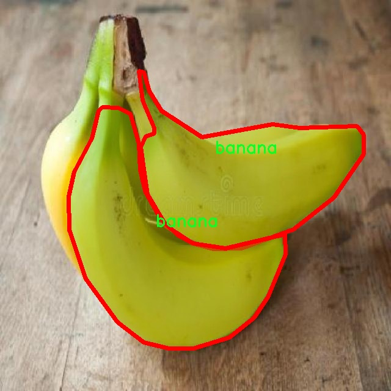

# 水果与蔬菜图像分割系统源码＆数据集分享
 [yolov8-seg-C2f-DySnakeConv＆yolov8-seg-timm等50+全套改进创新点发刊_一键训练教程_Web前端展示]

### 1.研究背景与意义

项目参考[ILSVRC ImageNet Large Scale Visual Recognition Challenge](https://gitee.com/YOLOv8_YOLOv11_Segmentation_Studio/projects)

项目来源[AAAI Global Al lnnovation Contest](https://kdocs.cn/l/cszuIiCKVNis)

研究背景与意义

随着全球人口的不断增长和城市化进程的加快，食品安全和农业生产效率已成为各国政府和研究机构关注的重点。水果和蔬菜作为人类日常饮食中不可或缺的组成部分，其种类繁多、营养丰富，对促进人类健康具有重要意义。然而，传统的水果和蔬菜的分类与分拣方式多依赖人工操作，效率低下且容易出现错误，无法满足现代化农业生产的需求。因此，开发一种高效、准确的水果与蔬菜图像分割系统显得尤为重要。

近年来，深度学习技术的迅猛发展为图像处理领域带来了革命性的变化，尤其是在目标检测和图像分割方面。YOLO（You Only Look Once）系列模型以其高效的实时处理能力和优越的检测精度，成为计算机视觉领域的热门选择。YOLOv8作为该系列的最新版本，进一步提升了模型的性能，具备了更强的特征提取能力和更高的分割精度。然而，针对水果与蔬菜的图像分割任务，现有的YOLOv8模型仍存在一定的局限性，特别是在处理复杂背景、遮挡和光照变化等情况下的表现。因此，基于改进YOLOv8的水果与蔬菜图像分割系统的研究具有重要的理论价值和实际意义。

本研究将基于一个包含3500张图像和13个类别的水果与蔬菜数据集，进行针对性的模型改进和优化。该数据集涵盖了多种常见的水果和蔬菜，如西兰花、洋葱、甘薯、苹果、香蕉等，具有较高的多样性和代表性。通过对这些图像进行实例分割，不仅可以实现对不同类别水果和蔬菜的精确识别，还能够有效地处理图像中的重叠和遮挡问题。这将为后续的自动化分拣系统提供强有力的技术支持，提升农业生产的智能化水平。

此外，研究成果的推广应用将对农业生产、物流配送及市场销售等环节产生深远影响。通过实现水果与蔬菜的自动化分拣，不仅可以提高生产效率，降低人力成本，还能减少因人为因素导致的损耗，提高食品的整体质量和安全性。同时，基于深度学习的图像分割技术的应用，也将为其他领域的图像处理提供借鉴，推动计算机视觉技术的进一步发展。

综上所述，基于改进YOLOv8的水果与蔬菜图像分割系统的研究，不仅在理论上丰富了目标检测与图像分割的研究内容，也在实践中为现代农业的智能化发展提供了新的思路和方法。通过对该系统的深入研究与应用，将为实现农业生产的高效、智能和可持续发展做出积极贡献。

### 2.图片演示


##### 注意：由于此博客编辑较早，上面“2.图片演示”和“3.视频演示”展示的系统图片或者视频可能为老版本，新版本在老版本的基础上升级如下：（实际效果以升级的新版本为准）

  （1）适配了YOLOV8的“目标检测”模型和“实例分割”模型，通过加载相应的权重（.pt）文件即可自适应加载模型。

  （2）支持“图片识别”、“视频识别”、“摄像头实时识别”三种识别模式。

  （3）支持“图片识别”、“视频识别”、“摄像头实时识别”三种识别结果保存导出，解决手动导出（容易卡顿出现爆内存）存在的问题，识别完自动保存结果并导出到tempDir中。

  （4）支持Web前端系统中的标题、背景图等自定义修改，后面提供修改教程。

  另外本项目提供训练的数据集和训练教程,暂不提供权重文件（best.pt）,需要您按照教程进行训练后实现图片演示和Web前端界面演示的效果。

### 3.视频演示

[3.1 视频演示](https://www.bilibili.com/video/BV1wkyoYmEpV/)

### 4.数据集信息展示

##### 4.1 本项目数据集详细数据（类别数＆类别名）

nc: 13
names: ['apple', 'banana', 'beet', 'carrot', 'cucumber', 'grape', 'kiwi', 'lemon', 'orange', 'pineapple', 'pomegranate', 'strawberry', 'tomato']


##### 4.2 本项目数据集信息介绍

数据集信息展示

在现代计算机视觉领域，图像分割技术的进步为各种应用提供了强大的支持，尤其是在农业和食品行业中。为了推动这一领域的发展，我们构建了一个名为“instance”的数据集，专门用于训练和改进YOLOv8-seg模型，以实现水果与蔬菜的高效图像分割。该数据集包含13个不同的类别，涵盖了常见的水果和蔬菜，具体类别包括：苹果、香蕉、甜菜、胡萝卜、黄瓜、葡萄、猕猴桃、柠檬、橙子、菠萝、石榴、草莓和西红柿。

“instance”数据集的构建旨在提供丰富的图像样本，以便模型能够学习到各种水果和蔬菜的特征。这些图像不仅涵盖了不同的光照条件和背景，还包括多种拍摄角度和距离，确保模型在实际应用中具备良好的泛化能力。每个类别的图像都经过精心挑选，确保其在颜色、形状和纹理等方面的多样性，使得模型能够准确识别和分割出每种水果和蔬菜。

在数据集的标注过程中，我们采用了高精度的分割标注技术，为每个图像中的水果和蔬菜对象提供了精确的边界框。这一过程不仅提升了数据集的质量，也为后续的模型训练提供了坚实的基础。通过对每个类别的详细标注，模型能够更好地理解不同物体之间的边界，从而实现更为精准的分割效果。

此外，数据集还包含了多种场景下的水果和蔬菜图像，包括自然环境、超市货架以及家庭厨房等。这种多样化的场景设置使得模型在处理不同应用场景时，能够展现出更强的适应性和鲁棒性。通过对不同环境的学习，模型能够识别出在不同背景下的水果和蔬菜，从而在实际应用中实现更高的准确率。

在训练过程中，我们将“instance”数据集与YOLOv8-seg模型相结合，利用其先进的深度学习算法进行训练。YOLOv8-seg模型以其高效的特征提取能力和实时处理能力，能够在保证精度的同时，快速处理大量图像数据。这使得我们的图像分割系统不仅能够满足高精度的需求，还能够在实际应用中实现实时反馈，极大地提升了用户体验。

通过对“instance”数据集的深入研究和应用，我们期望能够推动水果与蔬菜图像分割技术的发展，助力农业生产、食品安全检测以及智能零售等领域的创新。未来，我们将继续扩展数据集的规模和多样性，以便为更广泛的应用场景提供支持，并不断优化模型性能，确保其在实际应用中的有效性和可靠性。





### 5.全套项目环境部署视频教程（零基础手把手教学）

[5.1 环境部署教程链接（零基础手把手教学）](https://www.bilibili.com/video/BV1jG4Ve4E9t/?vd_source=bc9aec86d164b67a7004b996143742dc)


[5.2 安装Python虚拟环境创建和依赖库安装视频教程链接（零基础手把手教学）](https://www.bilibili.com/video/BV1nA4VeYEze/?vd_source=bc9aec86d164b67a7004b996143742dc)

### 6.手把手YOLOV8-seg训练视频教程（零基础小白有手就能学会）

[6.1 手把手YOLOV8-seg训练视频教程（零基础小白有手就能学会）](https://www.bilibili.com/video/BV1cA4VeYETe/?vd_source=bc9aec86d164b67a7004b996143742dc)


按照上面的训练视频教程链接加载项目提供的数据集，运行train.py即可开始训练



     Epoch   gpu_mem       box       obj       cls    labels  img_size
     1/200     0G   0.01576   0.01955  0.007536        22      1280: 100%|██████████| 849/849 [14:42<00:00,  1.04s/it]
               Class     Images     Labels          P          R     mAP@.5 mAP@.5:.95: 100%|██████████| 213/213 [01:14<00:00,  2.87it/s]
                 all       3395      17314      0.994      0.957      0.0957      0.0843

     Epoch   gpu_mem       box       obj       cls    labels  img_size
     2/200     0G   0.01578   0.01923  0.007006        22      1280: 100%|██████████| 849/849 [14:44<00:00,  1.04s/it]
               Class     Images     Labels          P          R     mAP@.5 mAP@.5:.95: 100%|██████████| 213/213 [01:12<00:00,  2.95it/s]
                 all       3395      17314      0.996      0.956      0.0957      0.0845

     Epoch   gpu_mem       box       obj       cls    labels  img_size
     3/200     0G   0.01561    0.0191  0.006895        27      1280: 100%|██████████| 849/849 [10:56<00:00,  1.29it/s]
               Class     Images     Labels          P          R     mAP@.5 mAP@.5:.95: 100%|███████   | 187/213 [00:52<00:00,  4.04it/s]
                 all       3395      17314      0.996      0.957      0.0957      0.0845


### 7.50+种全套YOLOV8-seg创新点代码加载调参视频教程（一键加载写好的改进模型的配置文件）

[7.1 50+种全套YOLOV8-seg创新点代码加载调参视频教程（一键加载写好的改进模型的配置文件）](https://www.bilibili.com/video/BV1Hw4VePEXv/?vd_source=bc9aec86d164b67a7004b996143742dc)

### 8.YOLOV8-seg图像分割算法原理

原始YOLOv8-seg算法原理

YOLOv8-seg算法是YOLO系列中的最新进展，专注于目标检测与实例分割的结合，旨在提供更高效且精确的视觉理解能力。该算法的设计理念源于YOLOv5的成功经验，但在多个方面进行了创新和优化，以适应更复杂的分割任务。YOLOv8-seg的核心在于其独特的网络架构和损失函数设计，使其在处理多种目标时，能够有效地分离并识别不同实例。

首先，YOLOv8-seg的骨干网络采用了跨级结构（Cross Stage Partial, CSP），这是一种通过将特征图分割成多个分支并进行并行处理的策略。与YOLOv5中的C3模块相比，YOLOv8-seg使用了更轻量化的C2F模块，旨在减少计算复杂度，同时保持高效的特征提取能力。C2F模块通过将输入特征图分为两个分支，分别进行卷积处理，从而实现更深层次的特征学习。每个分支的输出经过融合，形成更高维度的特征图，确保了信息的充分流动和梯度的有效传播。

在特征提取方面，YOLOv8-seg引入了快速空间金字塔池化（SPPF）结构，以增强对不同尺度特征的提取能力。该结构通过多层次的池化操作，有效地捕捉了图像中的多尺度信息，使得模型在处理各种尺寸的目标时，能够保持较高的检测精度。此外，YOLOv8-seg在特征融合层采用了特征金字塔网络（FPN）与路径聚合网络（PAN）的组合，这种结构不仅提高了特征信息的提取速度，还增强了模型对不同尺度目标的适应能力。

YOLOv8-seg在目标检测头的设计上也进行了创新，采用了无锚框（Anchor-Free）检测方式。这种方法直接预测目标的中心点及其宽高比例，避免了传统锚框方法中对预定义框的依赖，从而减少了模型的复杂性和计算量。这一设计使得YOLOv8-seg在处理密集目标时，能够更快速地进行推理，同时保持较高的准确性。

在损失函数的设计上，YOLOv8-seg采用了新的变焦损失策略，这一策略通过动态调整损失权重，使得模型在训练过程中能够更好地适应不同难度的样本。具体而言，分类损失通过变焦损失进行计算，而边界框损失则结合了数据平均保真度损失和完美交并比损失。这种多样化的损失计算方式，使得YOLOv8-seg在目标检测和实例分割任务中，能够更精准地定位目标边界，提高了分割的准确性。

此外，YOLOv8-seg还特别注重模型的轻量化设计。通过优化网络结构，减少不必要的卷积层和参数量，YOLOv8-seg能够在保证性能的同时，显著降低计算资源的消耗。这一特性使得YOLOv8-seg不仅适用于高性能的服务器环境，也能够在移动设备和边缘计算设备上高效运行，拓宽了其应用场景。

在实际应用中，YOLOv8-seg表现出了优异的性能，尤其是在复杂场景下的目标检测与分割任务中。通过自制数据集的实验验证，YOLOv8-seg在多种目标检测和实例分割的基准测试中，均取得了领先的结果。这一切都得益于其在网络结构、损失函数和模型轻量化等方面的创新设计，使得YOLOv8-seg不仅是一种强大的目标检测工具，更是一个灵活的实例分割解决方案。

综上所述，YOLOv8-seg算法通过对YOLO系列的深度优化，结合了轻量化设计、创新的特征提取与融合策略，以及先进的损失计算方法，成功地实现了目标检测与实例分割的高效融合。其在实际应用中的优异表现，预示着YOLOv8-seg在未来的计算机视觉领域将发挥更为重要的作用。


### 9.系统功能展示（检测对象为举例，实际内容以本项目数据集为准）

图9.1.系统支持检测结果表格显示

  图9.2.系统支持置信度和IOU阈值手动调节

  图9.3.系统支持自定义加载权重文件best.pt(需要你通过步骤5中训练获得)

  图9.4.系统支持摄像头实时识别

  图9.5.系统支持图片识别

  图9.6.系统支持视频识别

  图9.7.系统支持识别结果文件自动保存

  图9.8.系统支持Excel导出检测结果数据


### 10.50+种全套YOLOV8-seg创新点原理讲解（非科班也可以轻松写刊发刊，V11版本正在科研待更新）

#### 10.1 由于篇幅限制，每个创新点的具体原理讲解就不一一展开，具体见下列网址中的创新点对应子项目的技术原理博客网址【Blog】：


[10.1 50+种全套YOLOV8-seg创新点原理讲解链接](https://gitee.com/qunmasj/good)

#### 10.2 部分改进模块原理讲解(完整的改进原理见上图和技术博客链接)【如果此小节的图加载失败可以通过CSDN或者Github搜索该博客的标题访问原始博客，原始博客图片显示正常】

### YOLOv8简介
YoloV8模型结构
YOLOv3之前的所有YOLO对象检测模型都是用C语言编写的，并使用了Darknet框架，Ultralytics发布了第一个使用PyTorch框架实现的YOLO (YOLOv3)；YOLOv3之后，Ultralytics发布了YOLOv5，在2023年1月，Ultralytics发布了YOLOv8，包含五个模型，用于检测、分割和分类。 YOLOv8 Nano是其中最快和最小的，而YOLOv8 Extra Large (YOLOv8x)是其中最准确但最慢的，具体模型见后续的图。

YOLOv8附带以下预训练模型:

目标检测在图像分辨率为640的COCO检测数据集上进行训练。
实例分割在图像分辨率为640的COCO分割数据集上训练。
图像分类模型在ImageNet数据集上预训练，图像分辨率为224。
YOLOv8 概述
具体到 YOLOv8 算法，其核心特性和改动可以归结为如下：

提供了一个全新的SOTA模型（state-of-the-art model），包括 P5 640 和 P6 1280 分辨率的目标检测网络和基于YOLACT的实例分割模型。和 YOLOv5 一样，基于缩放系数也提供了 N/S/M/L/X 尺度的不同大小模型，用于满足不同场景需求
骨干网络和 Neck 部分可能参考了 YOLOv7 ELAN 设计思想，将 YOLOv5 的 C3 结构换成了梯度流更丰富的 C2f 结构，并对不同尺度模型调整了不同的通道数，属于对模型结构精心微调，不再是一套参数应用所有模型，大幅提升了模型性能。
Head 部分相比 YOLOv5 改动较大，换成了目前主流的解耦头结构，将分类和检测头分离，同时也从Anchor-Based 换成了 Anchor-Free
Loss 计算方面采用了TaskAlignedAssigner正样本分配策略，并引入了Distribution Focal Loss
训练的数据增强部分引入了 YOLOX 中的最后 10 epoch 关闭 Mosiac 增强的操作，可以有效地提升精度


### HRNet V2简介
现在设计高低分辨率融合的思路主要有以下四种：


（a）对称结构。如U-Net、Hourglass等，都是先下采样再上采样，上下采样过程对称。

（b）级联金字塔。如refinenet等，高低分辨率融合时经过卷积处理。

（c）简单的baseline，用转职卷积进行上采样。

（d）扩张卷积。如deeplab等，增大感受野，减少下采样次数，可以无需跳层连接直接进行上采样。

（b）（c）都是使用复杂一些的网络进行下采样（如resnet、vgg），再用轻量级的网络进行上采样。

HRNet V1是在（b）的基础上进行改进，从头到尾保持大的分辨率表示。然而HRNet V1仅是用在姿态估计领域的，HRNet V2对它做小小的改进可以使其适用于更广的视觉任务。这一改进仅仅增加了较小的计算开销，但却提升了较大的准确度。

#### 网络结构图：


这个结构图简洁明了就不多介绍了，首先图2的输入是已经经过下采样四倍的feature map，横向的conv block指的是basicblock 或 bottleblock，不同分辨率之间的多交叉线部分是multi-resolution convolution（多分辨率组卷积）。

到此为止HRNet V2和HRNet V1是完全一致的。

区别之处在于这个基网络上加的一个head：


图3介绍的是接在图2最后的head。（a）是HRNet V1的头，很明显他只用了大分辨率的特征图。（b）（c）是HRNet V2的创新点，（b）用与语义分割，（c）用于目标检测。除此之外作者还在实验部分介绍了用于分类的head，如图4所示。


#### 多分辨率block：


一个多分辨率block由多分辨率组卷积（a）和多分辨率卷积（b）组成。（c）是一个正常卷积的展开，（b）的灵感来源于（c）。代码中（a）部分由Bottleneck和BasicBlock组成。

多分辨率卷积和正常卷积的区别：（1）多分辨率卷积中，每个通道的subset的分辨率都不一样。（2）通道之间的连接如果是降分辨率，则用的是3x3的2stride的卷积，如果是升分辨率，用的是双线性最邻近插值上采样。


### 11.项目核心源码讲解（再也不用担心看不懂代码逻辑）

#### 11.1 ultralytics\hub\__init__.py

以下是对代码的逐文件分析，保留了最核心的部分，并进行了详细的中文注释：

```python
# 导入所需的库和模块
import requests
from ultralytics.data.utils import HUBDatasetStats
from ultralytics.hub.auth import Auth
from ultralytics.hub.utils import HUB_API_ROOT, HUB_WEB_ROOT, PREFIX
from ultralytics.utils import LOGGER, SETTINGS

def login(api_key=''):
    """
    使用提供的API密钥登录Ultralytics HUB API。

    参数:
        api_key (str, optional): 可以是API密钥或API密钥与模型ID的组合，例如key_id。

    示例:
        ```python
        from ultralytics import hub
        hub.login('API_KEY')
        ```
    """
    Auth(api_key, verbose=True)  # 调用Auth类进行登录

def logout():
    """
    通过从设置文件中移除API密钥来注销Ultralytics HUB。
    要再次登录，请使用'yolo hub login'。

    示例:
        ```python
        from ultralytics import hub
        hub.logout()
        ```
    """
    SETTINGS['api_key'] = ''  # 清空API密钥
    SETTINGS.save()  # 保存设置
    LOGGER.info(f"{PREFIX}logged out ✅. To log in again, use 'yolo hub login'.")  # 记录注销信息

def reset_model(model_id=''):
    """将训练好的模型重置为未训练状态。"""
    # 向API发送POST请求以重置模型
    r = requests.post(f'{HUB_API_ROOT}/model-reset', json={'apiKey': Auth().api_key, 'modelId': model_id})
    if r.status_code == 200:
        LOGGER.info(f'{PREFIX}Model reset successfully')  # 记录成功重置模型的信息
        return
    LOGGER.warning(f'{PREFIX}Model reset failure {r.status_code} {r.reason}')  # 记录重置失败的信息

def export_fmts_hub():
    """返回HUB支持的导出格式列表。"""
    from ultralytics.engine.exporter import export_formats
    return list(export_formats()['Argument'][1:]) + ['ultralytics_tflite', 'ultralytics_coreml']  # 返回支持的格式

def export_model(model_id='', format='torchscript'):
    """将模型导出为所有格式。"""
    # 确保格式是支持的格式之一
    assert format in export_fmts_hub(), f"Unsupported export format '{format}', valid formats are {export_fmts_hub()}"
    # 向API发送POST请求以导出模型
    r = requests.post(f'{HUB_API_ROOT}/v1/models/{model_id}/export',
                      json={'format': format},
                      headers={'x-api-key': Auth().api_key})
    assert r.status_code == 200, f'{PREFIX}{format} export failure {r.status_code} {r.reason}'  # 检查导出请求是否成功
    LOGGER.info(f'{PREFIX}{format} export started ✅')  # 记录导出开始的信息

def get_export(model_id='', format='torchscript'):
    """获取带有下载URL的导出模型字典。"""
    # 确保格式是支持的格式之一
    assert format in export_fmts_hub(), f"Unsupported export format '{format}', valid formats are {export_fmts_hub()}"
    # 向API发送POST请求以获取导出模型
    r = requests.post(f'{HUB_API_ROOT}/get-export',
                      json={
                          'apiKey': Auth().api_key,
                          'modelId': model_id,
                          'format': format})
    assert r.status_code == 200, f'{PREFIX}{format} get_export failure {r.status_code} {r.reason}'  # 检查请求是否成功
    return r.json()  # 返回导出模型的JSON数据

def check_dataset(path='', task='detect'):
    """
    在上传之前检查HUB数据集Zip文件的错误。
    它在数据集上传到HUB之前检查错误。

    参数:
        path (str, optional): 数据集zip文件的路径（其中包含data.yaml）。默认为''。
        task (str, optional): 数据集任务。选项有'detect'、'segment'、'pose'、'classify'。默认为'detect'。

    示例:
        ```python
        from ultralytics.hub import check_dataset
        check_dataset('path/to/coco8.zip', task='detect')  # 检查检测数据集
        ```
    """
    HUBDatasetStats(path=path, task=task).get_json()  # 检查数据集的统计信息
    LOGGER.info(f'Checks completed correctly ✅. Upload this dataset to {HUB_WEB_ROOT}/datasets/.')  # 记录检查完成的信息
```

### 核心功能概述：
1. **登录与注销**：提供登录和注销Ultralytics HUB的功能。
2. **模型重置**：能够将训练好的模型重置为未训练状态。
3. **导出模型**：支持将模型导出为多种格式，并能获取导出模型的下载链接。
4. **数据集检查**：在上传数据集之前检查其有效性。

这个文件是Ultralytics YOLO项目的一部分，主要用于与Ultralytics HUB进行交互。它包含了一些与用户认证、模型导出、数据集检查等相关的功能。

首先，文件导入了一些必要的模块，包括用于发送HTTP请求的`requests`库，以及一些Ultralytics项目中的工具模块，如`HUBDatasetStats`、`Auth`、`HUB_API_ROOT`等。这些模块提供了与HUB交互所需的功能和常量。

在`login`函数中，用户可以通过提供API密钥来登录Ultralytics HUB。该函数会创建一个`Auth`对象，并将API密钥传递给它。用户可以通过示例代码了解如何使用这个函数。

`logout`函数则用于登出，主要通过清空设置文件中的API密钥来实现。登出后，用户可以使用`yolo hub login`命令重新登录。这个函数在成功登出后会记录一条日志信息。

`reset_model`函数用于将训练过的模型重置为未训练状态。它通过向HUB的API发送POST请求来实现，成功后会记录成功信息，如果失败则会记录警告信息。

`export_fmts_hub`函数返回HUB支持的所有导出格式。它调用了`export_formats`函数，并在返回的格式列表中添加了特定的格式，如`ultralytics_tflite`和`ultralytics_coreml`。

`export_model`函数用于将模型导出为指定格式。它首先检查格式是否受支持，然后发送POST请求到HUB以开始导出过程。如果请求成功，记录导出开始的信息；如果失败，则抛出异常并记录错误信息。

`get_export`函数用于获取已导出的模型的下载链接。它同样会检查格式的有效性，并发送请求以获取导出模型的字典。如果请求成功，返回包含下载链接的JSON数据；如果失败，则抛出异常。

最后，`check_dataset`函数用于在上传数据集到HUB之前进行错误检查。它接受数据集的路径和任务类型作为参数，并使用`HUBDatasetStats`来检查数据集的有效性。检查完成后，会记录一条成功的信息，提示用户可以将数据集上传到指定的HUB网站。

总的来说，这个文件提供了一系列与Ultralytics HUB交互的功能，方便用户进行模型管理和数据集处理。

#### 11.2 ui.py

以下是保留的核心代码部分，并添加了详细的中文注释：

```python
import sys
import subprocess

def run_script(script_path):
    """
    使用当前 Python 环境运行指定的脚本。

    Args:
        script_path (str): 要运行的脚本路径

    Returns:
        None
    """
    # 获取当前 Python 解释器的路径
    python_path = sys.executable

    # 构建运行命令，使用 streamlit 运行指定的脚本
    command = f'"{python_path}" -m streamlit run "{script_path}"'

    # 执行命令
    result = subprocess.run(command, shell=True)
    
    # 检查命令执行的返回码，如果不为0则表示出错
    if result.returncode != 0:
        print("脚本运行出错。")

# 主程序入口
if __name__ == "__main__":
    # 指定要运行的脚本路径
    script_path = "web.py"  # 这里可以直接指定脚本路径

    # 调用函数运行脚本
    run_script(script_path)
```

### 代码注释说明：
1. **导入模块**：
   - `sys`：用于访问与 Python 解释器相关的变量和函数。
   - `subprocess`：用于创建新进程、连接到它们的输入/输出/错误管道，并获得返回码。

2. **run_script 函数**：
   - 接受一个参数 `script_path`，表示要运行的 Python 脚本的路径。
   - 使用 `sys.executable` 获取当前 Python 解释器的路径，以确保使用相同的环境运行脚本。
   - 构建一个命令字符串，使用 `streamlit` 模块运行指定的脚本。
   - 使用 `subprocess.run` 执行构建的命令，并检查返回码以判断脚本是否成功运行。

3. **主程序入口**：
   - 在 `if __name__ == "__main__":` 块中，指定要运行的脚本路径，并调用 `run_script` 函数来执行该脚本。

这个程序文件名为 `ui.py`，其主要功能是通过当前的 Python 环境来运行一个指定的脚本，具体是一个名为 `web.py` 的文件。程序首先导入了必要的模块，包括 `sys`、`os` 和 `subprocess`，以及一个自定义的 `abs_path` 函数，这个函数来自于 `QtFusion.path` 模块，可能用于获取文件的绝对路径。

在 `run_script` 函数中，首先获取当前 Python 解释器的路径，这样可以确保在正确的环境中运行脚本。接着，构建一个命令字符串，该命令使用 `streamlit` 来运行指定的脚本。`streamlit` 是一个用于构建数据应用的框架，这里通过 `-m` 参数来运行模块。

然后，使用 `subprocess.run` 方法执行构建好的命令。这个方法会在一个新的 shell 中运行命令，并等待其完成。如果脚本运行返回的状态码不为零，表示运行过程中出现了错误，程序会打印出相应的错误信息。

在文件的最后部分，使用 `if __name__ == "__main__":` 来确保只有在直接运行该脚本时才会执行后面的代码。此时，指定了要运行的脚本路径为 `web.py`，并调用 `run_script` 函数来执行该脚本。

总的来说，这个程序的主要作用是为用户提供一个简单的接口，以便在当前 Python 环境中运行一个特定的 Streamlit 脚本，并处理可能出现的错误。

#### 11.3 ultralytics\models\rtdetr\train.py

以下是代码中最核心的部分，并附上详细的中文注释：

```python
class RTDETRTrainer(DetectionTrainer):
    """
    RT-DETR模型的训练类，继承自YOLO的DetectionTrainer类。
    该模型由百度开发，专用于实时目标检测，利用视觉变换器（Vision Transformers）并具备IoU感知查询选择和可调的推理速度等特性。
    """

    def get_model(self, cfg=None, weights=None, verbose=True):
        """
        初始化并返回一个用于目标检测任务的RT-DETR模型。

        参数:
            cfg (dict, optional): 模型配置，默认为None。
            weights (str, optional): 预训练模型权重的路径，默认为None。
            verbose (bool): 如果为True，则启用详细日志，默认为True。

        返回:
            (RTDETRDetectionModel): 初始化后的模型。
        """
        # 创建RT-DETR检测模型实例
        model = RTDETRDetectionModel(cfg, nc=self.data['nc'], verbose=verbose and RANK == -1)
        # 如果提供了权重路径，则加载预训练权重
        if weights:
            model.load(weights)
        return model

    def build_dataset(self, img_path, mode='val', batch=None):
        """
        构建并返回用于训练或验证的RT-DETR数据集。

        参数:
            img_path (str): 包含图像的文件夹路径。
            mode (str): 数据集模式，可以是'train'或'val'。
            batch (int, optional): 矩形训练的批次大小，默认为None。

        返回:
            (RTDETRDataset): 针对特定模式的数据集对象。
        """
        # 创建RT-DETR数据集实例
        return RTDETRDataset(img_path=img_path,
                             imgsz=self.args.imgsz,
                             batch_size=batch,
                             augment=mode == 'train',  # 训练模式下启用数据增强
                             hyp=self.args,
                             rect=False,
                             cache=self.args.cache or None,
                             prefix=colorstr(f'{mode}: '),  # 为数据集模式添加前缀
                             data=self.data)

    def get_validator(self):
        """
        返回适用于RT-DETR模型验证的DetectionValidator。

        返回:
            (RTDETRValidator): 用于模型验证的验证器对象。
        """
        self.loss_names = 'giou_loss', 'cls_loss', 'l1_loss'  # 定义损失名称
        return RTDETRValidator(self.test_loader, save_dir=self.save_dir, args=copy(self.args))

    def preprocess_batch(self, batch):
        """
        预处理一批图像。将图像缩放并转换为浮点格式。

        参数:
            batch (dict): 包含一批图像、边界框和标签的字典。

        返回:
            (dict): 预处理后的批次。
        """
        # 调用父类的方法进行基本的预处理
        batch = super().preprocess_batch(batch)
        bs = len(batch['img'])  # 获取批次大小
        batch_idx = batch['batch_idx']  # 获取批次索引
        gt_bbox, gt_class = [], []  # 初始化真实边界框和类别列表
        for i in range(bs):
            # 收集当前批次中每个图像的真实边界框和类别
            gt_bbox.append(batch['bboxes'][batch_idx == i].to(batch_idx.device))
            gt_class.append(batch['cls'][batch_idx == i].to(device=batch_idx.device, dtype=torch.long))
        return batch  # 返回预处理后的批次
```

### 代码核心部分说明：
1. **RTDETRTrainer类**：这是一个专门为RT-DETR模型设计的训练类，继承自YOLO的训练类，主要用于处理实时目标检测任务。
2. **get_model方法**：用于初始化RT-DETR模型，并可选择加载预训练权重。
3. **build_dataset方法**：构建训练或验证数据集，支持数据增强和其他配置。
4. **get_validator方法**：返回用于模型验证的验证器对象，并定义损失名称。
5. **preprocess_batch方法**：对输入的图像批次进行预处理，包括缩放和格式转换，确保数据可以被模型正确使用。

这个程序文件是一个用于训练RT-DETR模型的Python脚本，属于Ultralytics YOLO框架的一部分。RT-DETR是一种基于视觉变换器（Vision Transformers）的实时目标检测模型，由百度开发。该文件定义了一个名为`RTDETRTrainer`的类，继承自`DetectionTrainer`类，以适应RT-DETR模型的特定特性和架构。

在类的文档字符串中，提到RT-DETR模型的几个关键特性，比如支持IoU感知的查询选择和可调的推理速度。此外，文档中也提到了一些注意事项，例如RT-DETR中使用的`F.grid_sample`不支持`deterministic=True`参数，且AMP（自动混合精度）训练可能导致NaN输出，并在二分图匹配过程中产生错误。

`RTDETRTrainer`类包含多个方法。`get_model`方法用于初始化并返回一个RT-DETR模型，接受模型配置和预训练权重的路径作为参数。该方法会根据提供的配置和类别数（从数据集中获取）创建模型，并在提供权重的情况下加载它们。

`build_dataset`方法用于构建并返回一个RT-DETR数据集，支持训练和验证模式。该方法接收图像路径、模式（训练或验证）和批量大小作为参数，并返回相应的`RTDETRDataset`对象。数据集的构建过程会根据模式决定是否进行数据增强。

`get_validator`方法返回一个适用于RT-DETR模型验证的检测验证器（`RTDETRValidator`）。在此方法中，还定义了损失名称，包括‘giou_loss’、‘cls_loss’和‘l1_loss’。

`preprocess_batch`方法用于预处理一批图像，主要是对图像进行缩放并转换为浮点格式。该方法首先调用父类的`preprocess_batch`方法，然后根据批次索引提取每个图像的真实边界框和类别，并将它们转换到相应的设备上。

总体来说，这个文件的主要功能是为RT-DETR模型的训练和验证提供支持，定义了模型的初始化、数据集的构建、验证器的获取以及批次数据的预处理等关键步骤。

#### 11.4 train.py

以下是代码中最核心的部分，并附上详细的中文注释：

```python
import os
import torch
import yaml
from ultralytics import YOLO  # 导入YOLO模型库

if __name__ == '__main__':  # 确保该模块被直接运行时才执行以下代码
    # 设置训练参数
    workers = 1  # 数据加载的工作进程数
    batch = 8  # 每个批次的样本数量
    device = "0" if torch.cuda.is_available() else "cpu"  # 判断是否使用GPU，若可用则使用GPU，否则使用CPU

    # 获取数据集的配置文件路径
    data_path = abs_path(f'datasets/data/data.yaml', path_type='current')  

    # 将路径转换为Unix风格（使用斜杠）
    unix_style_path = data_path.replace(os.sep, '/')
    # 获取数据集目录路径
    directory_path = os.path.dirname(unix_style_path)

    # 读取YAML配置文件
    with open(data_path, 'r') as file:
        data = yaml.load(file, Loader=yaml.FullLoader)

    # 修改YAML文件中的训练、验证和测试数据路径
    if 'train' in data and 'val' in data and 'test' in data:
        data['train'] = directory_path + '/train'  # 更新训练数据路径
        data['val'] = directory_path + '/val'      # 更新验证数据路径
        data['test'] = directory_path + '/test'    # 更新测试数据路径

        # 将修改后的数据写回YAML文件
        with open(data_path, 'w') as file:
            yaml.safe_dump(data, file, sort_keys=False)

    # 加载YOLO模型配置文件并加载预训练权重
    model = YOLO(r"C:\codeseg\codenew\50+种YOLOv8算法改进源码大全和调试加载训练教程（非必要）\改进YOLOv8模型配置文件\yolov8-seg-C2f-Faster.yaml").load("./weights/yolov8s-seg.pt")

    # 开始训练模型
    results = model.train(
        data=data_path,  # 指定训练数据的配置文件路径
        device=device,  # 指定使用的设备（CPU或GPU）
        workers=workers,  # 指定数据加载的工作进程数
        imgsz=640,  # 指定输入图像的大小为640x640
        epochs=100,  # 指定训练的轮数为100
        batch=batch,  # 指定每个批次的样本数量
    )
```

### 代码核心部分说明：
1. **导入库**：导入必要的库，包括操作系统、PyTorch、YAML解析库和YOLO模型库。
2. **参数设置**：设置训练过程中使用的参数，如工作进程数、批次大小和设备选择（GPU或CPU）。
3. **数据路径处理**：获取数据集的配置文件路径，并将其转换为统一的Unix风格路径，便于后续操作。
4. **读取和修改YAML文件**：读取YAML文件中的数据，更新训练、验证和测试数据的路径，并将修改后的内容写回文件。
5. **模型加载**：加载YOLO模型的配置文件和预训练权重。
6. **模型训练**：调用模型的训练方法，开始训练过程，指定数据、设备、工作进程、图像大小、训练轮数和批次大小等参数。

这个程序文件 `train.py` 是一个用于训练 YOLO（You Only Look Once）模型的脚本，主要使用了 PyTorch 框架和 Ultralytics 提供的 YOLO 实现。以下是对代码的逐行讲解。

首先，程序导入了一些必要的库，包括 `os`、`torch`、`yaml` 和 `matplotlib`。其中，`torch` 是用于深度学习的库，`yaml` 用于处理 YAML 格式的配置文件，`matplotlib` 则用于图形绘制。

在 `if __name__ == '__main__':` 语句下，确保该模块被直接运行时才执行后续代码。接下来，定义了一些训练参数，包括 `workers`（数据加载的工作进程数量）、`batch`（每个批次的样本数量）和 `device`（计算设备，优先使用 GPU）。

接着，程序通过 `abs_path` 函数获取数据集配置文件 `data.yaml` 的绝对路径，并将路径中的分隔符统一为 Unix 风格。然后，利用 `os.path.dirname` 获取该路径的目录部分。

随后，程序打开 `data.yaml` 文件并读取其内容，使用 `yaml.load` 保持原有顺序。接下来，检查 YAML 文件中是否包含 `train`、`val` 和 `test` 项，如果存在，则将它们的路径修改为相对于目录的路径。修改后的数据会重新写回到 YAML 文件中，确保后续训练可以正确找到数据集。

在模型加载部分，程序实例化了一个 YOLO 模型，使用指定的配置文件 `yolov8-seg-C2f-Faster.yaml` 和预训练权重 `yolov8s-seg.pt`。注释中提到，不同的模型配置可能对设备的要求不同，如果出现错误，可以尝试其他模型配置。

最后，程序调用 `model.train` 方法开始训练模型，传入训练数据的配置文件路径、计算设备、工作进程数量、输入图像大小（640x640）、训练的 epoch 数量（100）以及批次大小（8）。训练过程会根据这些参数进行模型的优化和调整。

总体而言，这个脚本是一个完整的 YOLO 模型训练流程，从数据准备到模型加载，再到训练参数的设置，提供了一个基础的训练框架。

#### 11.5 ultralytics\engine\trainer.py

以下是代码中最核心的部分，并附上详细的中文注释：

```python
class BaseTrainer:
    """
    BaseTrainer类是用于训练模型的基类。

    属性:
        args (SimpleNamespace): 训练器的配置参数。
        model (nn.Module): 模型实例。
        device (torch.device): 用于训练的设备。
        trainset (torch.utils.data.Dataset): 训练数据集。
        testset (torch.utils.data.Dataset): 测试数据集。
        optimizer (torch.optim.Optimizer): 优化器实例。
        scheduler (torch.optim.lr_scheduler._LRScheduler): 学习率调度器。
    """

    def __init__(self, cfg=DEFAULT_CFG, overrides=None):
        """
        初始化BaseTrainer类。

        参数:
            cfg (str, optional): 配置文件的路径，默认为DEFAULT_CFG。
            overrides (dict, optional): 配置覆盖，默认为None。
        """
        self.args = get_cfg(cfg, overrides)  # 获取配置
        self.device = select_device(self.args.device, self.args.batch)  # 选择设备
        self.model = None  # 初始化模型
        self.trainset, self.testset = None, None  # 初始化训练和测试数据集
        self.optimizer = None  # 初始化优化器
        self.scheduler = None  # 初始化学习率调度器

    def train(self):
        """开始训练过程。"""
        world_size = len(self.args.device.split(',')) if isinstance(self.args.device, str) else 1  # 计算使用的设备数量

        if world_size > 1:  # 如果使用多GPU训练
            self._setup_ddp(world_size)  # 设置分布式数据并行
        self._setup_train(world_size)  # 设置训练参数

        for epoch in range(self.args.epochs):  # 遍历每个epoch
            self.model.train()  # 设置模型为训练模式
            for batch in self.train_loader:  # 遍历训练数据
                self.optimizer.zero_grad()  # 清空梯度
                loss = self.model(batch)  # 前向传播计算损失
                loss.backward()  # 反向传播计算梯度
                self.optimizer.step()  # 更新参数

            # 在每个epoch结束后可以进行验证和其他操作
            self.validate()  # 验证模型性能

    def _setup_train(self, world_size):
        """设置训练参数和数据加载器。"""
        self.model = self.get_model()  # 获取模型
        self.train_loader = self.get_dataloader(self.trainset)  # 获取训练数据加载器
        self.optimizer = self.build_optimizer(self.model)  # 构建优化器
        self.scheduler = self.build_scheduler(self.optimizer)  # 构建学习率调度器

    def validate(self):
        """在验证集上评估模型性能。"""
        self.model.eval()  # 设置模型为评估模式
        with torch.no_grad():  # 不计算梯度
            for batch in self.test_loader:  # 遍历测试数据
                outputs = self.model(batch)  # 前向传播
                # 计算验证指标

    def get_model(self):
        """加载或创建模型。"""
        # 这里实现模型的加载逻辑
        pass

    def get_dataloader(self, dataset):
        """返回数据加载器。"""
        # 这里实现数据加载器的创建逻辑
        pass

    def build_optimizer(self, model):
        """构建优化器。"""
        return optim.Adam(model.parameters(), lr=self.args.lr)  # 使用Adam优化器

    def build_scheduler(self, optimizer):
        """构建学习率调度器。"""
        return optim.lr_scheduler.StepLR(optimizer, step_size=10, gamma=0.1)  # 每10个epoch学习率衰减为原来的0.1
```

### 代码说明：
1. **BaseTrainer类**：这是一个用于训练模型的基类，包含了模型训练的基本框架和流程。
2. **__init__方法**：初始化训练器的配置、设备、模型和数据集等。
3. **train方法**：负责启动训练过程，遍历每个epoch并处理训练数据。
4. **_setup_train方法**：设置训练参数，包括模型、数据加载器、优化器和学习率调度器。
5. **validate方法**：在验证集上评估模型性能。
6. **get_model、get_dataloader、build_optimizer、build_scheduler方法**：这些方法负责加载模型、创建数据加载器、构建优化器和学习率调度器。

通过这些核心部分，训练过程得以顺利进行，并可以根据需要进行扩展和修改。

这个程序文件是Ultralytics YOLO框架中的一个训练器类（`BaseTrainer`），用于在给定的数据集上训练YOLO模型。代码的结构和功能相对复杂，包含了多个方法和属性，下面是对其主要内容的讲解。

首先，文件导入了一些必要的库和模块，包括数学运算、文件操作、时间处理、PyTorch相关的模块等。接着，定义了一个`BaseTrainer`类，该类是所有训练器的基类，包含了训练所需的各种配置和方法。

在类的初始化方法中，`__init__`，首先通过`get_cfg`函数获取配置参数，并检查是否需要从保存的检查点恢复训练。然后，选择训练所用的设备（如CPU或GPU），并初始化一些重要的属性，如模型、数据集、优化器等。接下来，创建保存结果的目录，并保存配置参数到一个YAML文件中。

`BaseTrainer`类中定义了多个方法，其中包括添加和运行回调函数的方法（`add_callback`、`run_callbacks`），用于训练的主方法`train`，以及一些辅助方法，如设置分布式训练（`_setup_ddp`）、准备训练（`_setup_train`）和执行训练（`_do_train`）。

在训练过程中，模型会在每个epoch中进行训练，计算损失，并根据设定的优化器更新模型参数。每个epoch结束后，模型会进行验证，评估其性能，并根据验证结果保存模型的检查点。

此外，类中还实现了模型的保存（`save_model`）、验证（`validate`）、优化器的构建（`build_optimizer`）等功能。特别地，`save_model`方法会保存当前epoch的模型状态和相关的训练信息，以便后续恢复或分析。

在训练的每个阶段，都会调用相应的回调函数，以便在特定事件发生时执行用户自定义的操作，比如记录日志、绘制图表等。通过这种方式，用户可以灵活地扩展训练过程的功能。

总的来说，这个文件提供了一个结构化的框架，用于训练YOLO模型，涵盖了从数据准备、模型训练到结果保存的完整流程。它的设计考虑了多种训练场景，包括单GPU和多GPU训练，能够满足不同用户的需求。

#### 11.6 ultralytics\nn\backbone\CSwomTramsformer.py

以下是经过简化和注释的核心代码部分，保留了CSWin Transformer的主要结构和功能。

```python
import torch
import torch.nn as nn
import numpy as np

class Mlp(nn.Module):
    """多层感知机（MLP）模块"""
    def __init__(self, in_features, hidden_features=None, out_features=None, act_layer=nn.GELU, drop=0.):
        super().__init__()
        out_features = out_features or in_features  # 输出特征数
        hidden_features = hidden_features or in_features  # 隐藏层特征数
        self.fc1 = nn.Linear(in_features, hidden_features)  # 第一层线性变换
        self.act = act_layer()  # 激活函数
        self.fc2 = nn.Linear(hidden_features, out_features)  # 第二层线性变换
        self.drop = nn.Dropout(drop)  # Dropout层

    def forward(self, x):
        """前向传播"""
        x = self.fc1(x)
        x = self.act(x)
        x = self.drop(x)
        x = self.fc2(x)
        x = self.drop(x)
        return x

class CSWinBlock(nn.Module):
    """CSWin Transformer的基本块"""
    def __init__(self, dim, num_heads, mlp_ratio=4., drop=0., attn_drop=0.):
        super().__init__()
        self.dim = dim  # 输入特征维度
        self.num_heads = num_heads  # 注意力头数
        self.mlp_ratio = mlp_ratio  # MLP的隐藏层比率
        self.qkv = nn.Linear(dim, dim * 3)  # QKV线性变换
        self.norm1 = nn.LayerNorm(dim)  # 归一化层
        self.attn = LePEAttention(dim, num_heads=num_heads, attn_drop=attn_drop)  # 注意力层
        self.mlp = Mlp(in_features=dim, hidden_features=int(dim * mlp_ratio), out_features=dim)  # MLP层
        self.drop = nn.Dropout(drop)  # Dropout层

    def forward(self, x):
        """前向传播"""
        x = self.norm1(x)  # 归一化
        qkv = self.qkv(x).reshape(x.shape[0], -1, 3, self.dim).permute(2, 0, 1, 3)  # 计算QKV
        x = self.attn(qkv)  # 注意力计算
        x = x + self.drop(x)  # 残差连接
        x = x + self.drop(self.mlp(x))  # MLP后残差连接
        return x

class CSWinTransformer(nn.Module):
    """CSWin Transformer模型"""
    def __init__(self, img_size=640, in_chans=3, num_classes=1000, embed_dim=96, depth=[2, 2, 6, 2], num_heads=12):
        super().__init__()
        self.num_classes = num_classes
        self.embed_dim = embed_dim  # 嵌入维度

        # 初始卷积嵌入层
        self.stage1_conv_embed = nn.Sequential(
            nn.Conv2d(in_chans, embed_dim, kernel_size=7, stride=4, padding=2),
            nn.LayerNorm(embed_dim)
        )

        # CSWin块
        self.stage1 = nn.ModuleList([
            CSWinBlock(dim=embed_dim, num_heads=num_heads) for _ in range(depth[0])
        ])
        
        # 其他阶段（省略）...
        
    def forward(self, x):
        """前向传播"""
        x = self.stage1_conv_embed(x)  # 初始卷积嵌入
        for blk in self.stage1:
            x = blk(x)  # 通过CSWin块
        return x

# 示例模型创建
if __name__ == '__main__':
    inputs = torch.randn((1, 3, 640, 640))  # 随机输入
    model = CSWinTransformer()  # 创建模型
    res = model(inputs)  # 前向传播
    print(res.size())  # 输出结果尺寸
```

### 代码注释说明：
1. **Mlp类**：实现了一个简单的多层感知机，包含两层线性变换和激活函数。
2. **CSWinBlock类**：实现了CSWin Transformer的基本构建块，包含注意力机制和MLP。
3. **CSWinTransformer类**：实现了整个CSWin Transformer模型，包含输入层和多个CSWin块。
4. **前向传播**：在每个类中定义了`forward`方法，描述了数据如何在模型中流动。

通过这些核心部分和注释，可以更好地理解CSWin Transformer的结构和功能。

这个程序文件实现了CSWin Transformer模型，主要用于计算机视觉任务。代码中定义了多个类和函数，构成了模型的不同部分，包括多层感知机（Mlp）、注意力机制（LePEAttention）、CSWin块（CSWinBlock）、合并块（Merge_Block）以及整个CSWin Transformer模型（CSWinTransformer）。

首先，Mlp类实现了一个简单的多层感知机结构，包含两个线性层和一个激活函数（默认为GELU），并在每个线性层后应用了Dropout以防止过拟合。LePEAttention类实现了一种新的注意力机制，名为LePE（Learnable Position Encoding），它通过将输入图像分割成窗口并计算窗口内的注意力来提高计算效率。该类中定义了多个方法，包括将输入转换为窗口格式的im2cswin方法和获取位置编码的get_lepe方法。

CSWinBlock类则是CSWin Transformer的基本构建块，包含了注意力层和多层感知机。它支持不同的分支数量，具体取决于输入的分辨率，并通过归一化层来稳定训练过程。Merge_Block类用于在不同阶段之间合并特征图，使用卷积层来降低特征图的分辨率并进行归一化。

CSWinTransformer类是整个模型的核心，负责定义模型的结构，包括输入的卷积嵌入层、多个CSWinBlock层和合并块。模型的深度、头数、嵌入维度等参数可以通过构造函数进行配置。模型的前向传播方法将输入数据通过各个阶段，并在每个阶段提取特征。

此外，程序还定义了一些辅助函数，如img2windows和windows2img，用于在图像和窗口之间进行转换，以及用于加载预训练权重的update_weight函数。最后，提供了几个函数（CSWin_tiny、CSWin_small、CSWin_base、CSWin_large）用于创建不同规模的CSWin Transformer模型，并可以选择是否加载预训练权重。

在主程序部分，代码展示了如何实例化不同规模的CSWin Transformer模型，并通过随机生成的输入数据进行前向传播，输出每个阶段的特征图尺寸。这部分代码用于验证模型的正确性和功能。整体而言，该文件实现了一个高效且灵活的视觉Transformer模型，适用于各种计算机视觉任务。

### 12.系统整体结构（节选）

### 整体功能和构架概括

Ultralytics项目是一个用于目标检测和计算机视觉任务的深度学习框架，主要实现了YOLO系列模型及其变种。该项目的整体功能包括模型训练、验证、推理和模型架构的定义。它通过模块化的设计，使得不同的功能可以独立实现并进行组合，方便用户进行定制和扩展。

项目的核心架构包括以下几个部分：

1. **模型定义**：定义了不同的模型架构，如YOLO、RT-DETR和CSWin Transformer等，提供了灵活的配置选项。
2. **训练和验证**：提供了训练器类和训练脚本，支持多种训练模式和回调机制，以便于监控和调整训练过程。
3. **数据处理**：实现了数据集的加载和预处理功能，确保模型能够正确接收输入数据。
4. **推理和结果输出**：支持模型的推理功能，能够对新数据进行预测并输出结果。
5. **用户界面和交互**：提供了与Ultralytics HUB的交互功能，方便用户进行模型管理和数据集上传。

### 文件功能整理表

| 文件路径                                          | 功能描述                                                   |
|---------------------------------------------------|------------------------------------------------------------|
| `ultralytics/hub/__init__.py`                    | 提供与Ultralytics HUB交互的功能，包括登录、登出、模型导出等。 |
| `ui.py`                                          | 运行指定的Streamlit脚本（`web.py`），用于用户界面交互。   |
| `ultralytics/models/rtdetr/train.py`             | 定义RT-DETR模型的训练过程，包括模型初始化和数据集构建。   |
| `train.py`                                       | 训练YOLO模型的主脚本，负责加载数据和模型，启动训练过程。   |
| `ultralytics/engine/trainer.py`                  | 定义训练器基类，包含训练、验证、模型保存等功能。           |
| `ultralytics/nn/backbone/CSwomTransformer.py`   | 实现CSWin Transformer模型及其组件，包括注意力机制和块结构。  |
| `ultralytics/models/sam/modules/tiny_encoder.py` | 定义Tiny Encoder模块，用于特征提取和处理。                 |
| `ultralytics/models/yolo/pose/train.py`          | 训练YOLO姿态估计模型的脚本，负责数据加载和模型训练。       |
| `ultralytics/models/rtdetr/predict.py`           | 实现RT-DETR模型的推理功能，处理输入并输出预测结果。       |
| `ultralytics/models/yolo/__init__.py`            | 初始化YOLO模型模块，可能包含模型的导入和配置。             |
| `ultralytics/utils/instance.py`                  | 提供实例化工具和方法，可能用于模型和数据集的创建。         |
| `ultralytics/solutions/__init__.py`              | 初始化解决方案模块，可能包含不同的应用场景和功能。         |
| `ultralytics/utils/callbacks/raytune.py`         | 定义Ray Tune回调，用于超参数调优和训练过程监控。           |

以上表格总结了每个文件的主要功能，帮助理解Ultralytics项目的整体架构和各个模块之间的关系。

注意：由于此博客编辑较早，上面“11.项目核心源码讲解（再也不用担心看不懂代码逻辑）”中部分代码可能会优化升级，仅供参考学习，完整“训练源码”、“Web前端界面”和“50+种创新点源码”以“14.完整训练+Web前端界面+50+种创新点源码、数据集获取”的内容为准。

### 13.图片、视频、摄像头图像分割Demo(去除WebUI)代码

在这个博客小节中，我们将讨论如何在不使用WebUI的情况下，实现图像分割模型的使用。本项目代码已经优化整合，方便用户将分割功能嵌入自己的项目中。
核心功能包括图片、视频、摄像头图像的分割，ROI区域的轮廓提取、类别分类、周长计算、面积计算、圆度计算以及颜色提取等。
这些功能提供了良好的二次开发基础。

### 核心代码解读

以下是主要代码片段，我们会为每一块代码进行详细的批注解释：

```python
import random
import cv2
import numpy as np
from PIL import ImageFont, ImageDraw, Image
from hashlib import md5
from model import Web_Detector
from chinese_name_list import Label_list

# 根据名称生成颜色
def generate_color_based_on_name(name):
    ......

# 计算多边形面积
def calculate_polygon_area(points):
    return cv2.contourArea(points.astype(np.float32))

...
# 绘制中文标签
def draw_with_chinese(image, text, position, font_size=20, color=(255, 0, 0)):
    image_pil = Image.fromarray(cv2.cvtColor(image, cv2.COLOR_BGR2RGB))
    draw = ImageDraw.Draw(image_pil)
    font = ImageFont.truetype("simsun.ttc", font_size, encoding="unic")
    draw.text(position, text, font=font, fill=color)
    return cv2.cvtColor(np.array(image_pil), cv2.COLOR_RGB2BGR)

# 动态调整参数
def adjust_parameter(image_size, base_size=1000):
    max_size = max(image_size)
    return max_size / base_size

# 绘制检测结果
def draw_detections(image, info, alpha=0.2):
    name, bbox, conf, cls_id, mask = info['class_name'], info['bbox'], info['score'], info['class_id'], info['mask']
    adjust_param = adjust_parameter(image.shape[:2])
    spacing = int(20 * adjust_param)

    if mask is None:
        x1, y1, x2, y2 = bbox
        aim_frame_area = (x2 - x1) * (y2 - y1)
        cv2.rectangle(image, (x1, y1), (x2, y2), color=(0, 0, 255), thickness=int(3 * adjust_param))
        image = draw_with_chinese(image, name, (x1, y1 - int(30 * adjust_param)), font_size=int(35 * adjust_param))
        y_offset = int(50 * adjust_param)  # 类别名称上方绘制，其下方留出空间
    else:
        mask_points = np.concatenate(mask)
        aim_frame_area = calculate_polygon_area(mask_points)
        mask_color = generate_color_based_on_name(name)
        try:
            overlay = image.copy()
            cv2.fillPoly(overlay, [mask_points.astype(np.int32)], mask_color)
            image = cv2.addWeighted(overlay, 0.3, image, 0.7, 0)
            cv2.drawContours(image, [mask_points.astype(np.int32)], -1, (0, 0, 255), thickness=int(8 * adjust_param))

            # 计算面积、周长、圆度
            area = cv2.contourArea(mask_points.astype(np.int32))
            perimeter = cv2.arcLength(mask_points.astype(np.int32), True)
            ......

            # 计算色彩
            mask = np.zeros(image.shape[:2], dtype=np.uint8)
            cv2.drawContours(mask, [mask_points.astype(np.int32)], -1, 255, -1)
            color_points = cv2.findNonZero(mask)
            ......

            # 绘制类别名称
            x, y = np.min(mask_points, axis=0).astype(int)
            image = draw_with_chinese(image, name, (x, y - int(30 * adjust_param)), font_size=int(35 * adjust_param))
            y_offset = int(50 * adjust_param)

            # 绘制面积、周长、圆度和色彩值
            metrics = [("Area", area), ("Perimeter", perimeter), ("Circularity", circularity), ("Color", color_str)]
            for idx, (metric_name, metric_value) in enumerate(metrics):
                ......

    return image, aim_frame_area

# 处理每帧图像
def process_frame(model, image):
    pre_img = model.preprocess(image)
    pred = model.predict(pre_img)
    det = pred[0] if det is not None and len(det)
    if det:
        det_info = model.postprocess(pred)
        for info in det_info:
            image, _ = draw_detections(image, info)
    return image

if __name__ == "__main__":
    cls_name = Label_list
    model = Web_Detector()
    model.load_model("./weights/yolov8s-seg.pt")

    # 摄像头实时处理
    cap = cv2.VideoCapture(0)
    while cap.isOpened():
        ret, frame = cap.read()
        if not ret:
            break
        ......

    # 图片处理
    image_path = './icon/OIP.jpg'
    image = cv2.imread(image_path)
    if image is not None:
        processed_image = process_frame(model, image)
        ......

    # 视频处理
    video_path = ''  # 输入视频的路径
    cap = cv2.VideoCapture(video_path)
    while cap.isOpened():
        ret, frame = cap.read()
        ......
```


### 14.完整训练+Web前端界面+50+种创新点源码、数据集获取


# [下载链接：https://mbd.pub/o/bread/Zp2bmptu](https://mbd.pub/o/bread/Zp2bmptu)